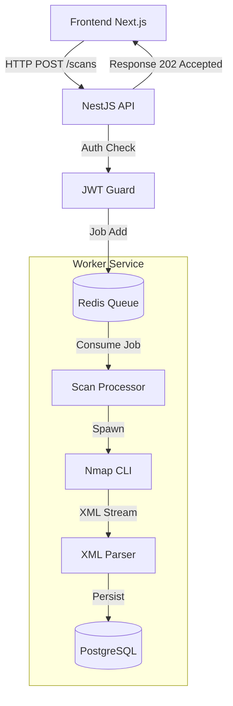

# 🛡️ VulnScanner - Plataforma de Análise de Vulnerabilidades


> Uma plataforma Fullstack para varredura de infraestrutura, orquestração de ferramentas de segurança (Nmap) e visualização de dados de inteligência de ameaças.


## 📋 Sobre o Projeto

O **VulnScanner** é uma solução de gerenciamento de vulnerabilidades que permite aos analistas de segurança executar varreduras de rede de forma assíncrona e visualizar os resultados em um dashboard centralizado.

Diferente de scripts simples de automação, este projeto foca em **Arquitetura de Software Robusta**, resolvendo problemas reais como:
- **Bloqueio de Event Loop:** Uso de filas (Redis) para processar scans pesados sem travar a API.
- **Concorrência:** Gerenciamento de múltiplos processos de análise simultâneos.
- **Tratamento de Dados:** Parsing complexo de outputs XML (Nmap) para dados relacionais estruturados.
- **IAM & Segurança:** Autenticação JWT e proteção de rotas críticas.

## 🚀 Tecnologias Utilizadas

### Backend (API & Worker)
- **NestJS**: Framework Node.js para arquitetura modular e escalável.
- **BullMQ (Redis)**: Gerenciamento de filas para processamento assíncrono (Producer/Consumer pattern).
- **Prisma ORM**: Modelagem de dados e interação com banco PostgreSQL.
- **Passport & JWT**: Autenticação e controle de sessão stateless.
- **Child Processes**: Execução segura de ferramentas de sistema operacional.

### Frontend (Dashboard)
- **Next.js 14+ (App Router)**: Renderização e roteamento moderno.
- **Tailwind CSS & Shadcn/UI**: Design system responsivo e acessível.
- **Recharts**: Visualização de dados estatísticos (Top Vulnerabilities).
- **Context API**: Gerenciamento de estado de autenticação.

### Infraestrutura & Tools
- **Docker & Docker Compose**: Orquestração dos serviços de banco de dados e cache.
- **PostgreSQL**: Persistência de dados relacionais e logs de auditoria.
- **Redis**: Backend para filas de mensagens.
- **Nmap**: Engine de varredura de rede (Network Mapper).

---

## 🏗️ Arquitetura do Sistema

O sistema segue o padrão de **Producer-Consumer** para garantir alta disponibilidade da API.


## ✨ Funcionalidades
- [x] Autenticação Segura: Login e Registro com hash de senha (Bcrypt) e JWT.

- [x] Dashboard em Tempo Real: Visualização de status de scans (Pending, Processing, Completed).

- [x] Gráficos de Inteligência: Métricas de portas mais expostas na infraestrutura.

- [x] Motor de Scan Assíncrono: Execução do Nmap em background.

- [x] Relatórios Detalhados: Visualização rica (Modal) com serviços, versões e SO detectados.

- [x] Histórico de Auditoria: Registro de quem solicitou cada análise.

## 📦 Como Rodar Localmente
### Pré-requisitos
- Node.js (v18+)

- Docker & Docker Compose

- Nmap  instalado na máquina host (necessário para o worker funcionar).

    - Linux: ```sudo apt install nmap```

    - Windows: Baixar instalador oficial.

### 1. Infraestrutura (Banco e Fila)
Na raiz do projeto, suba os containers:
```Bash
docker-compose up -d
```
### 2. Backend (API)
```Bash
cd backend

# Instalar dependências
npm install

# Configurar variáveis de ambiente (.env)
# Certifique-se que o DATABASE_URL aponta para o Docker

# Rodar Migrations
npx prisma migrate dev

# Iniciar Servidor (Porta 3000)
npm run start:dev
```

### 3. Frontend (Web)
```Bash
cd frontend

# Instalar dependências
npm install

# Iniciar Aplicação (Porta 3001/3000)
npm run dev
```
### 4. Credenciais de Acesso
Acesse o frontend no navegador. Crie uma conta ou use as credenciais de teste (se tiver seedado o banco):

- Email: admin@scanner.com

- Senha: 123